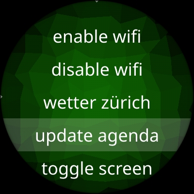

# script-shell

App for [AsteroidOS](https://asteroidos.org/) that provides an interface for running scripts on your watch.

**script-shell** lists scripts (executable files) in `/home/ceres/script-shell`. 
It then lets you run those scripts and displays some stdout messages and the state on the watch display.




## Build and install

First install the SDK: https://wiki.asteroidos.org/index.php/Installing_the_SDK

```bash
# build package
export CMAKE_PROGRAM_PATH=/usr/local/oecore-x86_64/sysroots/armv7vehf-neon-oe-linux-gnueabi/usr/bin/
source /usr/local/oecore-x86_64/environment-setup-armv7vehf-neon-oe-linux-gnueabi
cmake -B build -DCMAKE_INSTALL_PREFIX:PATH=/usr
cmake --build build --target package

# install package
scp build/*.ipk root@192.168.2.15:.
ssh root@192.168.2.15 "opkg install script-shell*.ipk"
```

More about building AsteroidOS apps: https://wiki.asteroidos.org/index.php/Creating_an_Asteroid_app

## Conventions for scripts

**script-shell** scans and displays all **executable** files installed in `/home/ceres/script-shell`.

_Files must be executable_ (`chmod 700 script.sh`). Else they will be ingored.

### File name

1. Files will be sorted alphanumericly.
2. Leading digits, followed by a `_` will not be displayed.
3. File-extensions (everything after the `.`) will be ommited too.
4. `-` and `_` signs will be replaced by a space (` `).

Example filename: `01_Hello-World.sh`

### Example script

```bash
#!/bin/sh

# Lines on stdout that beginn with a `->` are getting displayed on the watch.
# All other text output will be ignored.
echo "-> Hello World"
echo "ignored output"

# A return value of 0 indicatates success. 
# All other return values are interpreted as error.
exit 0 
```

### More examples

See [doc/example-scripts](doc/example-scripts) for some examples.
